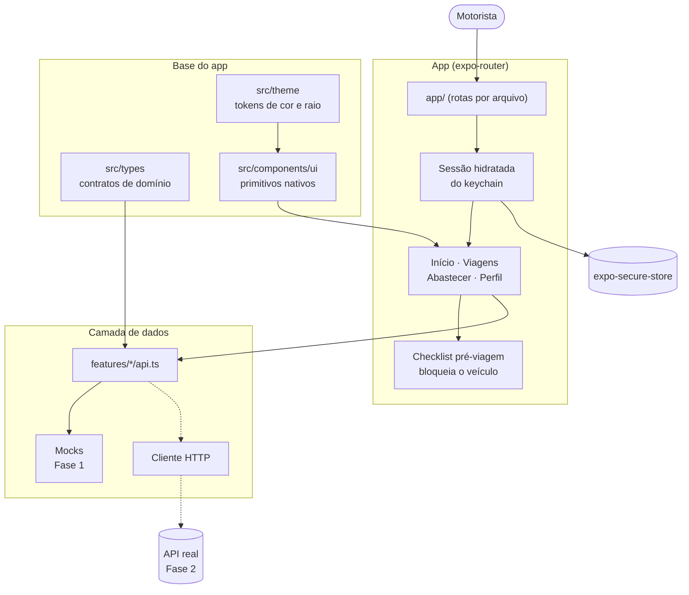

<p align="center">
  <picture>
    <source media="(prefers-color-scheme: dark)" srcset="assets/brand/logo-rookhub-white.svg"/>
    
  </picture>
</p>

<h2 align="center">App do Motorista</h2>

<p align="center">
  Viagens, checklist pré-viagem e abastecimento na mão de quem dirige. <em>É aqui que o dado da frota nasce.</em>
</p>

<div data-importer="techs" align="center">
  
  
  <picture>
    <source media="(prefers-color-scheme: dark)" srcset="https://cdn.simpleicons.org/expo/FFFFFF"/>
    
  </picture>
  
  
  
  
  
  
  
  
</div>

---

## Sobre o projeto

### O problema

Uma transportadora acompanha a operação em pedaços: rastreador num site, abastecimento numa
planilha, multas por e-mail e custo por quilômetro só no fechamento do mês, quando já não dá para
corrigir. E o motorista gera esse dado no papel e no WhatsApp.

### A proposta

O **RookHub** é uma plataforma **SaaS** que reúne essa operação em um lugar só. Este repositório
entrega a ponta de campo dela: o **app do motorista**, para Play Store e App Store. Viagem,
checklist e abastecimento saem daqui e alimentam o custo por quilômetro, o bloqueio de veículo e o
score de segurança que o gestor vê do outro lado.

O painel administrativo ([`../System-web`](../System-web)) e o site institucional
([`../Website`](../Website)) são projetos irmãos, fora deste repositório.

### O que existe hoje

**Fase 1 (MVP)**: app navegável com **dados simulados**, para provar a experiência antes de existir
backend. As telas dependem de `features/<nome>/api.ts` e nunca dos mocks; na Fase 2 troca-se a
implementação sem reescrever tela.

Fora de escopo nesta fase: backend, autenticação real, telemetria e IA.

### Destaques

- **Checklist pré-viagem que bloqueia o veículo**: item crítico reprovado exige foto e trava a
  saída (RF-016 / RN-040)
- **Abastecimento com comprovante**: km/l apurado na hora e anomalia de consumo explicada
- **Ergonomia de campo**: toque de 48pt, escuro para a cabine à noite e claro para o pátio ao sol
- **Camada de dados isolada** atrás do contrato de cada feature

---

## Tecnologias utilizadas

| Categoria     | Ferramenta                                                                | Versão          |
| ------------- | ------------------------------------------------------------------------- | --------------- |
| Execução      | [Node.js LTS](https://nodejs.org/pt-br/download)                          | 20+             |
| Gerenciador   | [npm](https://docs.npmjs.com/)                                            | 10+             |
| Linguagem     | [TypeScript](https://www.typescriptlang.org/)                             | 5.9.3           |
| App nativo    | [Expo](https://expo.dev/) SDK                                             | 54.0.36         |
| Framework     | [React Native](https://reactnative.dev/) + [React](https://react.dev/)    | 0.81.5 / 19.1.0 |
| Rotas         | [expo-router](https://docs.expo.dev/router/introduction/)                 | 6.0.24          |
| Dados e cache | [TanStack Query](https://tanstack.com/query)                              | 5.64.1          |
| Estado global | [Zustand](https://zustand.docs.pmnd.rs/)                                  | 5.0.3           |
| Formulários   | [React Hook Form](https://react-hook-form.com/) + [Zod](https://zod.dev/) | 7.54.2 / 3.24.1 |
| Animação      | [Reanimated](https://docs.swmansion.com/react-native-reanimated/)         | 4.1.7           |
| Ícones        | [@expo/vector-icons](https://icons.expo.fyi/)                             | 15.1.1          |
| Qualidade     | [Prettier](https://prettier.io/)                                          | 3.4.2           |

> **Não há ESLint nem suíte de testes neste repositório.** O gate de qualidade hoje é
> `npm run validate` + gerar os bundles nativos + rodar o app no Expo Go. Configurar os dois é uma
> pendência registrada em [`docs/ARCHITECTURE.md`](docs/ARCHITECTURE.md).

---

## Estrutura do projeto

```
System-mobile/
├── app/                     # Rotas por arquivo (expo-router)
│   ├── (tabs)/              # index · trips · fuel · profile
│   ├── trip/[id].tsx        # Detalhe da viagem
│   ├── fuel-entry.tsx       # Registro de abastecimento
│   ├── checklist.tsx        # Checklist pré-viagem
│   ├── login.tsx
│   └── _layout.tsx          # Provedores, tema e decisão de rota por sessão
├── src/
│   ├── features/            # Um módulo por domínio: api, schema, store, components
│   │   ├── auth/
│   │   ├── checklist/
│   │   ├── fuel/
│   │   ├── journey/
│   │   └── profile/
│   ├── components/ui/       # Primitivos nativos: SheetScreen, Card, Button, Field, Chip…
│   ├── lib/                 # Formatação e regras puras
│   ├── mocks/               # Dados simulados, fora dos componentes
│   ├── theme/               # Tokens dos dois esquemas, provider e preferência
│   └── types/               # Contratos de domínio, até o OpenAPI existir
├── assets/                  # Ícone, splash e marcas da RookHub
├── app.json                 # Configuração do Expo
└── docs/                    # ARCHITECTURE · PRODUCT · DESIGN · design-reference
```

A organização é **por feature**: `features/<nome>/` reúne `api.ts`, `schema.ts`, `store.ts` e os
componentes do mesmo domínio. As telas ficam em `app/`, porque o roteamento é por arquivo.

Pasta, arquivo e rota são **sempre em inglês**; o texto que o motorista lê é **sempre em pt-BR**. O
caminho é código, o título da tela é interface: `app/trip/[id].tsx` se apresenta como "Viagem".

---

## Arquitetura

As telas nunca acessam os dados simulados diretamente: elas dependem apenas do contrato em
`features/<nome>/api.ts`. Trocar a simulação pela API real, na Fase 2, não exige reescrever
nenhuma tela.



Consulte [`docs/ARCHITECTURE.md`](docs/ARCHITECTURE.md) para as decisões técnicas, a
linguagem visual e as convenções de código que valem em todo PR.

---

## Como executar

### Pré-requisitos

| Ferramenta | Versão | Download                          |
| ---------- | ------ | --------------------------------- |
| Node.js    | 20+    | https://nodejs.org/pt-br/download |
| Git        | any    | https://git-scm.com/downloads/win |
| Expo Go    | SDK 54 | Play Store / App Store            |

### Passos

```bash
# 1. Clonar o repositório
git clone https://github.com/v2ntechnology/System-mobile.git
cd System-mobile

# 2. Instalar dependências
npm install

# 3. Subir o servidor de desenvolvimento
npm run dev
```

Com o servidor no ar, use os atalhos do terminal:

| Tecla | O que faz                                                               |
| ----- | ----------------------------------------------------------------------- |
| `a`   | abre no Android                                                         |
| `i`   | abre no iOS                                                             |
| `w`   | abre o preview no navegador do computador (mesmo que `npm run dev:web`) |
| `r`   | recarrega o app                                                         |

Ou leia o QR Code com o **Expo Go**. O celular precisa estar na mesma rede Wi-Fi do computador. O
navegador é preview de desenvolvimento: o produto entregue é iOS e Android.

### Scripts disponíveis

| Comando                  | Descrição                                   |
| ------------------------ | ------------------------------------------- |
| `npm run dev`            | Sobe o servidor do Expo e imprime o QR Code |
| `npm run dev:web`        | Abre o preview no navegador do computador   |
| `npm run android`        | Abre no emulador/dispositivo Android        |
| `npm run ios`            | Abre no simulador/dispositivo iOS           |
| `npm run typecheck`      | Verifica os tipos do projeto inteiro        |
| `npm run format`         | Formata com Prettier                        |
| `npm run format:check`   | Confere a formatação sem reescrever         |
| `npm run check:deps`     | Confere versões compatíveis com o Expo      |
| `npm run doctor`         | Diagnostica configuração e módulos nativos  |
| `npm run export:android` | Gera o bundle de produção para Android      |
| `npm run export:ios`     | Gera o bundle de produção para iOS          |
| `npm run validate`       | Executa os gates estáticos e o Expo Doctor  |

Antes de fechar qualquer marco, rode a bateria e deixe-a limpa:

```bash
npm run validate
npm run export:android
npm run export:ios
```

E **abra o app no Expo Go**: uma tela nativa quebrada passa reto pelo `typecheck`.

---

## Equipe

<table align="center">
  <tr>
    <td align="center" width="200">
      <a href="https://github.com/LucasDias777">
        
      </a>
      <br/><br/>
      <a href="https://github.com/LucasDias777">
        
      </a>
    </td>
    <td align="center" width="200">
      <a href="https://github.com/vinicim002">
        
      </a>
      <br/><br/>
      <a href="https://github.com/vinicim002">
        
      </a>
    </td>
    <td align="center" width="200">
      <a href="https://github.com/Felipy116">
        
      </a>
      <br/><br/>
      <a href="https://github.com/Felipy116">
        
      </a>
    </td>
  </tr>
</table>

---

<p align="center">
  Feito com dedicação pela equipe <strong>V2N Tech</strong>
</p>
